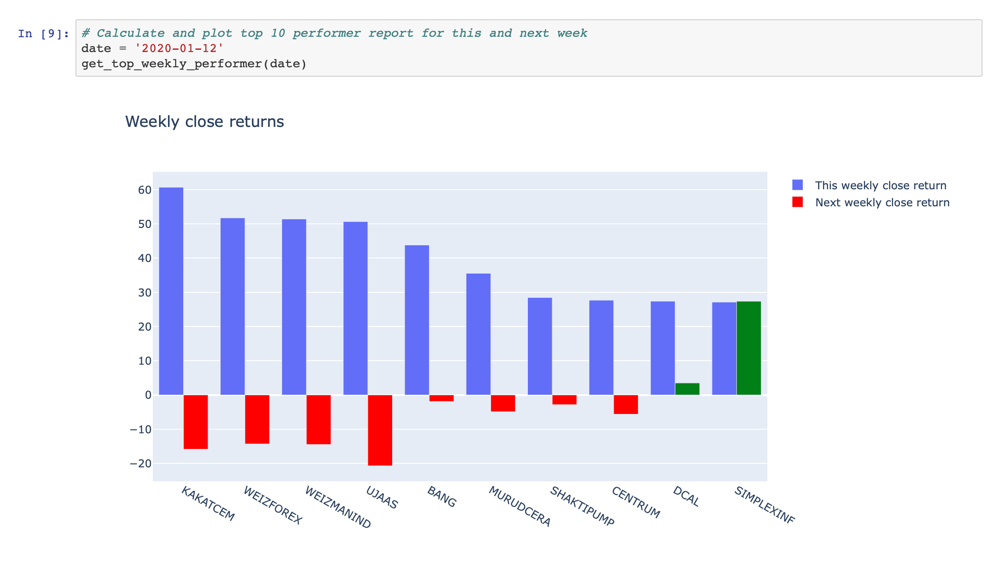

# indian-stock-market-analysis-for-top-weekly-performer

### Task performed:

1. Fetching price data from NSE website.
2. Pre-processing data as per requirements.
3. Fetching top 10 performer in given data of week.
4. Analyzing there performance in coming week.

### Output

